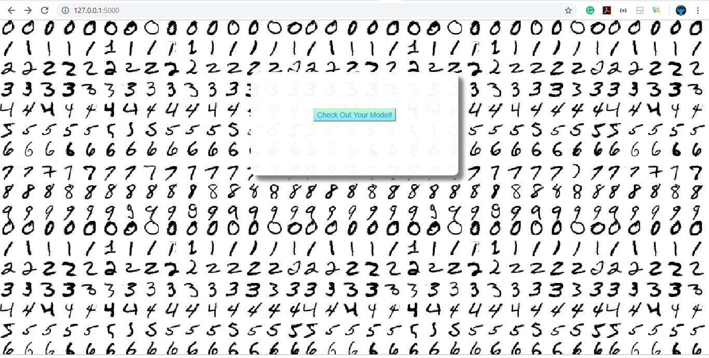

# Mnist, flask and Pytorch

A Flask web app for playing around with the *Mnist dataset*.

Understand how to implementing a `pytorch` model End to End and deplotyin Flask


## Run the flask App
To run the app:
```
set FLASK_APP = app.py
flask run
------------ or -----------
python app.py
```

Then connect to : http://127.0.0.1:5000/ in the browser

## Usage

<p align="center"> First, Train the model </p>


<p align="center"> Then, after cliking on the button you can visualize your model</p>


## Built with

* [flask](http://flask.pocoo.org/)

* [pytorch](https://www.pytorch.org/) 

* [Sketchpad](https://github.com/yiom/sketchpad) - Sketchpad to draw number


## Model Used ##

```python
class NN(nn.Module):
    def __init__(self):
        super(NN, self).__init__()
        self.conv1 = nn.Conv2d(1, 20, 3, 1)
        self.conv2 = nn.Conv2d(20, 50, 3, 1)
        self.fc1 = nn.Linear(5*5*50, 500)
        self.fc2 = nn.Linear(500, 10)

    def forward(self, x):
        x = F.relu(self.conv1(x))
        x = F.max_pool2d(x, 2, 2) #13
        x = F.relu(self.conv2(x)) #11
        x = F.max_pool2d(x, 2, 2) #5*5*50
        x = x.view(-1, 5*5*50)    #flatten
        x = F.relu(self.fc1(x))
        x = self.fc2(x)
        return F.log_softmax(x, dim=1)
```

The above architecture used gave acc of 99.4% for just 5 epochs

# Steps for Training and Deployment

1. Train the CNN model on **MNIST dataset**  by clicking this [4_1_TrainMnistForFlask.ipynb](../4_1_TrainMnistForFlask.ipynb) file.
2. Saved the trained weights with `mnist_cnn.pt` name in [4_2_mnist_deployed_pytorch folder](../4_2_mnist_deployed_pytorch).
3. Run the flask app as explained below.


# Note 

If model architecture is changed in  [4_1_TrainMnistForFlask.ipynb](../4_1_TrainMnistForFlask.ipynb) file corresponding architecture should also be update in flask `app.py` file 